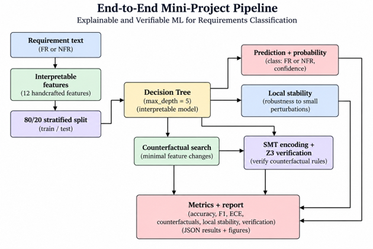

# Explainable and Verifiable ML for Requirements Classification

A small implementation study inspired by the VerifAI-LORE architecture.

**Research Grant:** IT137-26-330  
**Project:** Digital Person - Safely Integrating Machine Learning into Clinical Decision Support Systems  
**Institution:** University of Coimbra  
**Author:** Amir Hozhabri  
**Date:** September 2026

---

## 1. Project Overview

This project implements a small, reproducible prototype that combines:

1. Requirements classification
2. Probability-based confidence estimation
3. Local-stability analysis
4. Feature-space counterfactual explanations
5. SMT-based consistency checking with Z3

The project is inspired by methodological ideas from:

> Barbosa, R., Rinzivillo, S., Robin, J., Beretta, A., & Madeira, H. (2026).  
> A software architecture for verifiable and explainable classification.  
> *Machine Learning*, 115, 92.  
> DOI: 10.1007/s10994-026-07006-0

This repository contains a small implementation study. It is not a full reproduction of the VerifAI-LORE architecture.

---

## 2. Research Question

**Can a small and interpretable requirements classifier be augmented with confidence estimation, feature-space counterfactual explanations, and formal consistency checking in one reproducible pipeline?**

---

## 3. Scope

The application domain is software requirements classification:

- Functional Requirements (FR)
- Non-Functional Requirements (NFR)

The project uses:

- an interpretable Decision Tree classifier
- a small fixed feature space
- probability-based confidence
- local-stability analysis
- feature-space counterfactual generation
- SMT-based logical encoding
- Z3 consistency checking

This project does not address:

- clinical prediction
- patient data
- clinical safety
- clinical validation
- patient-level assessment
- human-subject evaluation
- clinical deployment
- full reproduction of VerifAI-LORE
- general claims of formal-verification expertise

---

## 4. End-to-End Pipeline



**Figure 1.** End-to-end pipeline for explainable and verifiable requirements classification, including interpretable feature extraction, stratified train-test split, Decision Tree classification, confidence and local-stability analysis, feature-space counterfactual search, SMT encoding with Z3 verification, and quantitative reporting.

## 5. Dataset

The implemented dataset contains **969 software requirements**.

Original dataset fields:

- `ProjectID`
- `RequirementText`
- `_class_`

Original labels:

| Label | Count |
|---|---:|
| A | 31 |
| F | 444 |
| FT | 18 |
| L | 15 |
| LF | 49 |
| MN | 24 |
| O | 77 |
| PE | 67 |
| PO | 12 |
| SC | 22 |
| SE | 125 |
| US | 85 |

For this binary study:

- `F` is mapped to `FR` (label 0)
- every other original label is mapped to `NFR` (label 1)

Final binary distribution:

| Class | Count |
|---|---:|
| FR | 444 |
| NFR | 525 |
| Total | 969 |

The dataset used in the experiments is stored in:

```text
data/requirements_dataset.csv
```

**Dataset license and attribution:** The PROMISE_exp dataset source file states that the dataset is distributed under the Creative Commons Attribution-Share Alike 3.0 License (CC BY-SA 3.0). Users redistributing the dataset or derived versions should retain the required attribution and license terms.
---

## 6. Interpretable Feature Representation

The classifier uses 12 explicitly defined features:

1. `length_words`
2. `sentence_count`
3. `fr_cue_count`
4. `nfr_cue_count`
5. `negation_count`
6. `has_digit`
7. `has_unit`
8. `has_shall`
9. `has_must`
10. `passive_indicator`
11. `has_list_marker`
12. `uppercase_ratio`

The feature space is intentionally small and explicit so that counterfactual generation and logical verification remain interpretable.

A counterfactual in this project is a **feature-space counterfactual**. It is not automatically a fluent or semantically valid rewritten requirement sentence.

---

## 7. Experimental Configuration

The baseline configuration is:

| Parameter | Value |
|---|---:|
| Total samples | 969 |
| Training samples | 775 |
| Test samples | 194 |
| Train/test split | 80/20 stratified |
| Random seed | 42 |
| Decision Tree max depth | 5 |
| Decision Tree class weight | balanced |
| Decision Tree leaves | 24 |
| ECE bins | 10 |The split is stratified by the binary class label.

---

## 8. Classification Results

All numerical values in this section were obtained from the executed implementation.

| Metric | Result |
|---|---:|
| Accuracy | 0.6753 |
| Macro-F1 | 0.6733 |
| Macro-Precision | 0.6961 |
| Macro-Recall | 0.6863 |

### Confusion Matrix

```text
[[73, 16],
 [47, 58]]
```

Class order:

```text
0 = FR
1 = NFR
```

---

## 9. Confidence and Calibration

Probability-based confidence is defined as the maximum predicted class probability.

This value is a model output and is **not a formal guarantee**.

### Results

| Metric | Result |
|---|---:|
| Mean confidence | 0.7770 |
| Mean local stability | 0.7964 |
| Expected Calibration Error (ECE) | 0.1017 |
| Brier score | 0.2185 |

### Accuracy by Confidence Range

| Confidence range | Number of test cases | Accuracy |
|---|---:|---:|
| < 0.60 | 0 | N/A |
| 0.60–0.79 | 137 | 0.6058 |
| >= 0.80 | 57 | 0.8421 |

The calibration figure is stored in:

```text
results/figures/calibration_plot.png
```

---

## 10. Counterfactual Explanation

The counterfactual module searches the predefined feature space for a minimally changed instance that receives the target class.

The search prioritizes:

1. minimum number of changed features
2. minimum normalized feature change among equally sparse candidates

For the reported experiment:

| Metric | Result |
|---|---:|
| Selected test cases | 30 |
| Counterfactuals generated | 30 |
| Valid counterfactuals | 30 |
| Counterfactual validity | 1.0000 |
| Counterfactual coverage | 1.0000 |
| Average sparsity | 1.0667 |
| Average normalized magnitude | 0.3129 |

Each generated counterfactual is checked again against the original Decision Tree.

**Interpretation note:** because the generator records a counterfactual only after
finding a target-reaching candidate, the reported validity of 1.0000 is a
post-generation verification result. Coverage indicates how many selected
test cases received a valid counterfactual.

Counterfactual results are stored in:

```text
results/counterfactual_examples.json
```

---

## 11. SMT Encoding and Formal Consistency Checking

The trained Decision Tree is represented as a set of root-to-leaf logical paths.

Each internal Decision Tree node contributes a condition such as:

```text
feature <= threshold
```

or:

```text
feature > threshold
```

Each leaf is represented as a conjunction of its path conditions.

The class condition is represented as the disjunction of all leaf paths predicting that class.

The resulting logical model is checked with Z3.

---

## 12. Encoder Validation

Before interpreting verification results, the logical encoding was compared with the original scikit-learn Decision Tree.

### Random validation

```text
Cases checked: 500
Mismatch count: 0
```

### Boundary validation

```text
Boundary cases checked: 42
Boundary mismatches: 0
```

### Leaf checks

```text
Leaf coverage verified: True
Leaf exclusivity violations: 0
```

These checks provide evidence that the implemented logical encoding agrees with the original Decision Tree on the tested feature domain.

---

## 13. Counterfactual Verification

The exact counterfactual points were checked using the encoded Decision Tree.

For the exact-point property:

```text
Counterfactual rules checked: 30
UNSAT: 30
SAT: 0
```

An `UNSAT` result means that, under the encoded model and stated feature-domain constraints, no counterexample was found for the exact point being checked.

A second, more general changed-feature rule was also evaluated:

```text
Changed-feature-rule UNSAT: 0
Changed-feature-rule SAT: 30
```

These generalized rules constrain only the changed features and leave the other features free. Therefore, they can admit counterexamples even when the exact counterfactual point is valid.

Verification results are stored in:

```text
results/verification_cases.json
```

---

## 14. Reproducibility

The project uses fixed experimental settings.

### Python and package versions

```text
Python 3.12
pandas 2.2.2
numpy 1.26.4
scikit-learn 1.5.0
matplotlib 3.9.0
z3-solver 5.1.0.0
```

### Main configuration

```text
Random seed: 42
Test size: 0.20
Decision Tree max_depth: 5
```

The main numerical results are stored in:

```text
results/metrics.json
```

---

## 15. Repository Structure

```text
mini-project/
|
|-- data/
|   |-- requirements_dataset.csv
|   `-- README.md
|
|-- src/
|   |-- data_loader.py
|   |-- features.py
|   |-- classifier.py
|   |-- confidence.py
|   |-- counterfactual.py
|   |-- tree_encoder.py
|   |-- verifier.py
|   `-- pipeline.py
|
|-- results/
|   |-- metrics.json
|   |-- counterfactual_examples.json
|   |-- verification_cases.json
|   `-- figures/
|       `-- calibration_plot.png
|
|-- tests/
|
|-- report/
|
|-- requirements.txt
|-- .gitignore
`-- README.md
```

---

## 16. Installation

From the project root:

```bash
python -m pip install -r requirements.txt
```

---

## 17. Running the Full Pipeline

From the project root:

```bash
python src\pipeline.py
```

The pipeline executes:

1. baseline classification
2. confidence and calibration analysis
3. counterfactual generation
4. Decision Tree SMT encoding
5. formal verification

---

## 18. Output Files

The main generated outputs are:

```text
results/metrics.json
results/counterfactual_examples.json
results/verification_cases.json
results/figures/calibration_plot.png
```

---

## 19. Limitations

This project is a small methodological prototype.

Important limitations include:

- The requirements domain is substantially simpler than a clinical setting.
- Results cannot be transferred directly to oncology or clinical decision support.
- Feature-space counterfactuals do not guarantee semantic validity of rewritten requirements.
- Probability-based confidence is not a formal confidence guarantee.
- Local stability is a simplified approximation and depends on the perturbation strategy and feature domain.
- SMT verification is dependent on the correctness of the logical encoding and the validity of the feature constraints.
- Verification of the Decision Tree does not verify the correctness of the dataset, labels, feature extraction, or intended real-world use.
- The dataset size and the use of one classifier family limit generalization.
- No clinical validation, expert clinical review, or patient-level assessment is performed.

---

## 20. Relationship to IT137-26-330

The mini-project provides a small implementation corresponding to four methodological components of the Digital Person work plan:

| IT137-26-330 component | Mini-project implementation |
|---|---|
| Knowledge Base | Interpretable feature extraction |
| ML-based Recommendations | Decision Tree + probability-based confidence |
| Formal Assurances | Exact Decision Tree SMT encoding + Z3 consistency checking |
| Evaluation | Classification, calibration, counterfactual, and verification metrics |

---

## 21. Scientific Reporting Note

This repository documents a small implementation study inspired by methodological ideas from verifiable and explainable classification.

The reported verification results apply only to the encoded Decision Tree and the explicitly defined feature-domain assumptions used in the implementation.

The project does not establish:

- clinical validity
- medical safety
- deployment readiness
- correctness of the underlying dataset
- correctness of requirement labels
- general formal-verification expertise

---

## 22. References

1. Barbosa, R., Rinzivillo, S., Robin, J., Beretta, A., & Madeira, H. (2026).

**A software architecture for verifiable and explainable classification.**

*Machine Learning*, 115, 92.

DOI: 10.1007/s10994-026-07006-0

2. Lima, M., Valle, V., Costa, E., Lira, F., & Gadelha, B. (2019).

**Software Engineering Repositories: Expanding the PROMISE Database.**

*Proceedings of the XXXIII Brazilian Symposium on Software Engineering (SBES 2019)*, 427–436.

DOI: 10.1145/3350768.3350776

Dataset repository:

https://github.com/AleksandarMitrevski/se-requirements-classification

The PROMISE_exp ARFF distribution contains a Creative Commons Attribution-Share Alike 3.0 notice for the PROMISE dataset.

---

## 23. Author

**Amir Hozhabri**

Research interests include machine learning, natural language processing, reinforcement learning, requirements analysis, quantitative evaluation, explainable AI, and verifiable machine learning.
